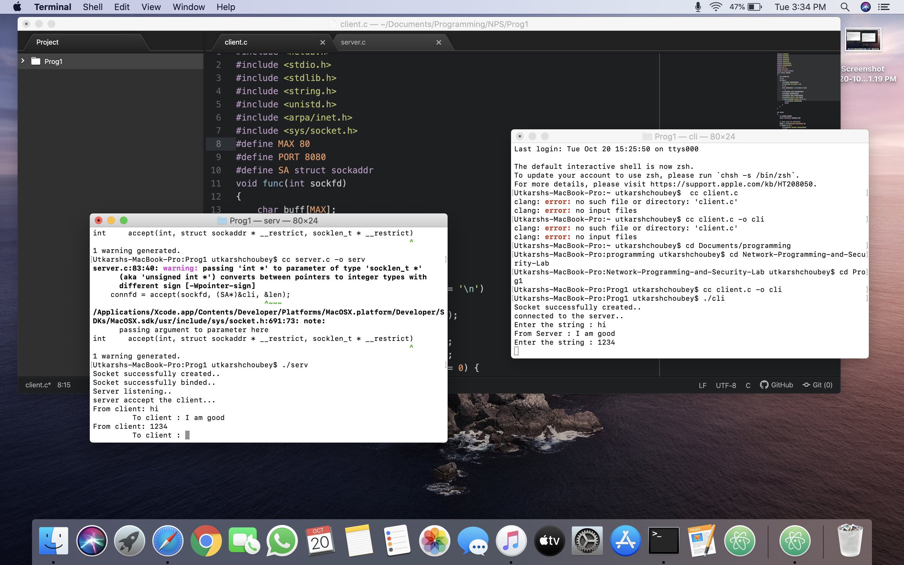

# Implement a client and server communication using sockets programming.

Follow the following steps :-

- Open the terminal and run the server file

cc server.c -o serv
./serv

- Open another terminal window and run the client file

cc client.c -o cli
./cli

Client Server communication Established!!

